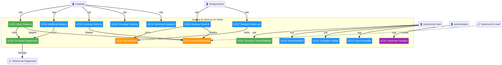

# Documento de Concepção do Projeto

## Sistema de Reserva de Hotéis

---

**Instituição:** Universidade Presbiteriana Mackenzie
**Disciplina:** Prática Profissional em Análise e Desenvolvimento de Sistemas
**Professor:** Tomaz Mikio Sasaki
**Data:** 14 de janeiro de 2026

---

## Sumário

1.  [Introdução](#1-introdução)
2.  [Informações Gerais do Projeto](#2-informações-gerais-do-projeto)
    1.  [Integrantes do Grupo](#21-integrantes-do-grupo)
    2.  [Links de Acesso](#22-links-de-acesso)
3.  [Análise de Requisitos](#3-análise-de-requisitos)
    1.  [Interessados (Stakeholders)](#31-interessados-stakeholders)
    2.  [Objetivos Funcionais](#32-objetivos-funcionais)
    3.  [Objetivos Não-Funcionais](#33-objetivos-não-funcionais)
4.  [Casos de Uso do Sistema](#4-casos-de-uso-do-sistema)
    1.  [Diagrama de Casos de Uso](#41-diagrama-de-casos-de-uso)
    2.  [Descrição Detalhada dos Casos de Uso Principais](#42-descrição-detalhada-dos-casos-de-uso-principais)
5.  [Referências](#5-referências)

---

### Lista de Figuras

*   [Figura 1: Diagrama de Casos de Uso do Sistema de Reserva de Hotéis](#figura-1)

### Lista de Tabelas

*   [Tabela 1: Interessados do Sistema](#tabela-1)
*   [Tabela 2: Detalhamento do Caso de Uso UC01](#tabela-2)
*   [Tabela 3: Detalhamento do Caso de Uso UC02](#tabela-3)
*   [Tabela 4: Detalhamento do Caso de Uso UC03](#tabela-4)

---

## 1. Introdução

Este documento apresenta a fase de **Concepção** do projeto de desenvolvimento de um **Sistema de Reserva de Hotéis**. O trabalho é realizado no âmbito da disciplina de Prática Profissional em Análise e Desenvolvimento de Sistemas e segue os princípios do Processo Unificado (PU), um modelo de desenvolvimento de software iterativo e incremental que organiza o ciclo de vida em quatro fases distintas: Concepção, Elaboração, Construção e Transição [1, 2].

O objetivo desta entrega é formalizar o escopo inicial do projeto, identificar os principais interessados (stakeholders), definir os objetivos funcionais e não-funcionais, e detalhar os casos de uso mais críticos que nortearão as primeiras iterações de desenvolvimento, conforme preconizado por metodologias de modelagem de software [3, 5]. A concepção é a fase fundamental para estabelecer uma visão clara do produto e garantir o alinhamento entre as necessidades do negócio e a solução técnica a ser construída.

---

## 2. Informações Gerais do Projeto

### 2.1. Integrantes do Grupo

*   Samyra Driele Alborgueti

### 2.2. Links de Acesso

*   **URL do Repositório de Código-Fonte:** `file:///home/ubuntu/hotel-reservation-system`
*   **URL do Quadro de Acompanhamento:** `file:///home/ubuntu/hotel-reservation-system/docs/project_tracking.md`

---

## 3. Análise de Requisitos

### 3.1. Interessados (Stakeholders)

Os interessados, ou stakeholders, são todos os indivíduos ou grupos que são afetados pelo sistema ou que podem influenciar seu desenvolvimento. A identificação correta é crucial para o levantamento completo dos requisitos.

**Tabela 1: Interessados do Sistema**

| Categoria | Interessado | Descrição do Interesse |
| :--- | :--- | :--- |
| **Usuários Finais** | Hóspedes | Realizar reservas de forma rápida e segura, consultar informações e gerenciar suas estadias. |
| | Gerentes de Hotel | Otimizar a gestão de ocupação, maximizar a receita e obter relatórios estratégicos. |
| | Recepcionistas | Facilitar as operações de check-in e check-out, e ter acesso rápido às informações das reservas. |
| | Administradores | Garantir a estabilidade, segurança e manutenção contínua do sistema. |
| **Internos** | Equipe de Desenvolvimento | Construir um software de alta qualidade, manutenível e escalável. |
| **Externos** | Proprietários do Hotel | Aumentar a lucratividade, melhorar a eficiência operacional e a satisfação do cliente. |

### 3.2. Objetivos Funcionais

Os objetivos funcionais definem as capacidades e serviços que o sistema deve prover aos seus usuários.

*   **OF1:** Permitir que hóspedes pesquisem e realizem reservas de quartos online.
*   **OF2:** Gerenciar a disponibilidade de quartos em tempo real.
*   **OF3:** Processar pagamentos de forma segura através de múltiplos métodos.
*   **OF4:** Enviar notificações automáticas (confirmação, lembretes) por e-mail.
*   **OF5:** Permitir que hóspedes modifiquem ou cancelem suas reservas, sujeitos a regras de negócio.
*   **OF6:** Registrar as operações de check-in e check-out dos hóspedes.
*   **OF7:** Manter um cadastro centralizado de hóspedes e seu histórico.
*   **OF8:** Gerar relatórios gerenciais sobre ocupação, faturamento e outras métricas.
*   **OF9:** Permitir a configuração de tarifas, temporadas e promoções.

### 3.3. Objetivos Não-Funcionais

Os objetivos não-funcionais especificam critérios de qualidade e restrições operacionais do sistema.

*   **Desempenho:** O tempo de resposta para buscas de disponibilidade deve ser inferior a 2 segundos, mesmo com 1.000 usuários simultâneos.
*   **Segurança:** Aderência à LGPD, criptografia de dados sensíveis e transações financeiras, e armazenamento seguro de senhas.
*   **Confiabilidade:** O sistema deve ter uma disponibilidade de 99.5%, com rotinas de backup automáticas e um plano de recuperação de desastres.
*   **Usabilidade:** A interface deve ser intuitiva, responsiva (adaptável a dispositivos móveis) e acessível (WCAG 2.1 AA).

---

## 4. Casos de Uso do Sistema

### 4.1. Diagrama de Casos de Uso

O diagrama a seguir ilustra as principais interações entre os atores e os casos de uso identificados para o sistema.

**Figura 1: Diagrama de Casos de Uso do Sistema de Reserva de Hotéis**

### 4.2. Descrição Detalhada dos Casos de Uso Principais

Conforme a metodologia do Processo Unificado, detalhamos nesta fase os 20% de casos de uso considerados mais essenciais para o negócio.

**Tabela 2: Detalhamento do Caso de Uso UC01**

| Campo | Descrição |
| :--- | :--- |
| **ID** | UC01 |
| **Nome** | Fazer Reserva de Quarto |
| **Descrição** | Permite que um Hóspede pesquise por quartos, selecione uma opção e confirme a reserva mediante pagamento. |
| **Atores** | Hóspede (Primário), Sistema de Pagamento (Secundário) |
| **Fluxo Principal** | 1. Hóspede informa datas e busca quartos. 2. Sistema exibe opções disponíveis. 3. Hóspede seleciona quarto e informa dados pessoais. 4. Sistema invoca o **UC02: Processar Pagamento**. 5. Após sucesso, a reserva é criada, o quarto é marcado como indisponível e um e-mail de confirmação é enviado. |

**Tabela 3: Detalhamento do Caso de Uso UC02**

| Campo | Descrição |
| :--- | :--- |
| **ID** | UC02 |
| **Nome** | Processar Pagamento |
| **Descrição** | Coleta os dados de pagamento e processa a transação através de um gateway externo. |
| **Atores** | Sistema (Primário), Sistema de Pagamento (Secundário) |
| **Fluxo Principal** | 1. Sistema exibe formulário seguro de pagamento. 2. Hóspede insere os dados do cartão de crédito ou seleciona PIX. 3. Sistema envia a transação para o gateway de pagamento. 4. Gateway autoriza a transação e retorna sucesso. 5. Sistema registra o pagamento e confirma a reserva. |

**Tabela 4: Detalhamento do Caso de Uso UC03**

| Campo | Descrição |
| :--- | :--- |
| **ID** | UC03 |
| **Nome** | Gerenciar Disponibilidade de Quartos |
| **Descrição** | Permite que o Gerente de Hotel visualize a ocupação e bloqueie quartos para manutenção. |
| **Atores** | Gerente de Hotel (Primário) |
| **Fluxo Principal** | 1. Gerente acessa o painel de gestão de quartos. 2. Sistema exibe o calendário de ocupação. 3. Gerente seleciona um quarto e um período. 4. Gerente define o status como "Em Manutenção". 5. Sistema atualiza a disponibilidade, impedindo novas reservas no período. |

---

## 5. Referências

[1] JACOBSON, I.; BOOCH, G.; RUMBAUGH, J. **The Unified Software Development Process**. Reading: Addison-Wesley, 1999.

[2] SOMMERVILLE, I. **Engenharia de Software**. 9. ed. São Paulo: Pearson Prentice Hall, 2011.

[3] GOMAA, H. **Software Modeling and Design: UML, Use Cases, Patterns, and Software Architectures**. Cambridge: Cambridge University Press, 2011.

[4] KRUCHTEN, P. **The Rational Unified Process: An Introduction**. 3. ed. Reading: Addison-Wesley, 2003.

[5] LARMAN, C. **Utilizando UML e padrões**: uma introdução à análise e ao projeto orientados a objetos e desenvolvimento iterativo. 3. ed. Porto Alegre: Bookman, 2011.
