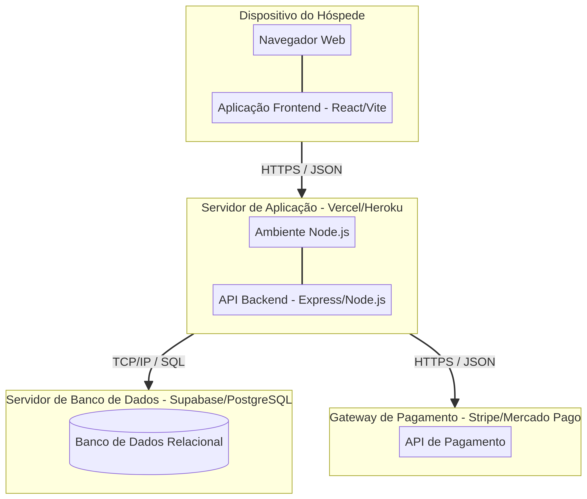

# UNIVERSIDADE PRESBITERIANA MACKENZIE
## PRÁTICA PROFISSIONAL EM ANÁLISE E DESENVOLVIMENTO DE SISTEMAS

     

### GABRIELA REFOSCO
### JULIO DE MOURA STELZER
### LAZARO JUNIOR DOS SANTOS
### SAMYRA DRIELE ALBORGUETI

     

# SISTEMA DE RESERVA DE HOTÉIS:
## RELATÓRIO DA 1ª ITERAÇÃO DA FASE DE CONSTRUÇÃO

     

**Professores:**
Prof. Paula
Prof. Cristiano

     

**SÃO PAULO**
**2026**

---

## SUMÁRIO

1. [INTRODUÇÃO](#1-introdução)
2. [INFORMAÇÕES GERAIS DO PROJETO](#2-informações-gerais-do-projeto)
3. [GUIA DO USUÁRIO](#3-guia-do-usuário)
4. [DIAGRAMA DE IMPLANTAÇÃO](#4-diagrama-de-implantação)
5. [VÍDEO DE DEMONSTRAÇÃO](#5-vídeo-de-demonstração)
6. [REFERÊNCIAS](#6-referências)

---

## 1. INTRODUÇÃO

Este documento apresenta os resultados da 1ª iteração da fase de **Construção** do projeto de desenvolvimento de um **Sistema de Reserva de Hotéis**. O trabalho é realizado no âmbito da disciplina de Prática Profissional em Análise e Desenvolvimento de Sistemas e segue os princípios do Processo Unificado (PU) [1].

Na fase de Construção, o foco principal é o desenvolvimento iterativo e incremental do software, transformando os modelos arquiteturais e de design elaborados nas fases anteriores em código executável. Ao final de cada iteração desta fase, espera-se a entrega de uma versão parcial do software, integrada, testada e implantada, com qualidade o mais próxima possível da qualidade de produção [2].

Esta entrega específica contempla a disponibilização do código-fonte em repositório de controle de versão (identificado por uma *tag* específica), a atualização do quadro de acompanhamento do projeto (Kanban), a elaboração de um Guia do Usuário, a apresentação do Diagrama de Implantação e a gravação de um vídeo demonstrativo da aplicação em funcionamento.

---

## 2. INFORMAÇÕES GERAIS DO PROJETO

### 2.1. Integrantes do Grupo

*   Gabriela Refosco
*   Julio de Moura Stelzer
*   Lazaro Junior dos Santos
*   Samyra Driele Alborgueti

### 2.2. Links de Acesso

*   **URL do Repositório de Código-Fonte:** https://github.com/devsamyra/hotel-reservation-system
*   **URL do Quadro de Acompanhamento (Kanban):** https://github.com/users/devsamyra/projects/1
*   **URL da Aplicação Publicada:** https://hotel-reservation-system-devsamyra.vercel.app

---

## 3. GUIA DO USUÁRIO

O Guia do Usuário tem como objetivo orientar os usuários finais sobre como acessar e utilizar as principais funcionalidades do Sistema de Reserva de Hotéis, garantindo uma experiência fluida e intuitiva.

### 3.1. Acesso ao Sistema

Para acessar a aplicação, o usuário deve utilizar um navegador web atualizado e acessar o link oficial do projeto hospedado na internet: [https://hotel-reservation-system-devsamyra.vercel.app](https://hotel-reservation-system-devsamyra.vercel.app).

### 3.2. Funcionalidades Principais

#### 3.2.1. Pesquisa de Hotéis e Quartos

1.  Na página inicial (**Home**), localize a barra de busca central.
2.  Informe o **Destino** desejado.
3.  Selecione as datas de **Check-in** e **Check-out** no calendário.
4.  Indique o número de **Hóspedes**.
5.  Clique no botão **"Buscar"**.
6.  O sistema exibirá uma lista de hotéis disponíveis que atendem aos critérios informados, apresentando fotos, preços por diária e avaliações de outros usuários.

#### 3.2.2. Realização de Reserva

1.  Após analisar a lista de resultados, clique no *card* do hotel escolhido para visualizar mais detalhes.
2.  Na página de detalhes do hotel, selecione o tipo de quarto desejado (ex: Suíte Luxo, Quarto Standard).
3.  Clique no botão **"Reservar Agora"** para prosseguir para a etapa de pagamento.

#### 3.2.3. Checkout e Pagamento

1.  Na tela de **Checkout**, preencha o formulário com seus dados pessoais (Nome Completo, E-mail, Telefone).
2.  Escolha o método de pagamento de sua preferência: **Cartão de Crédito** ou **PIX**.
3.  Caso opte por Cartão de Crédito, insira os dados solicitados de forma segura (o sistema utiliza criptografia para proteger suas informações financeiras).
4.  Revise o resumo da reserva apresentado no lado direito da tela, confirmando as datas, o tipo de quarto e o valor total (incluindo taxas e impostos).
5.  Clique no botão **"Confirmar Reserva"**.
6.  Após o processamento bem-sucedido do pagamento, o sistema exibirá uma mensagem de confirmação e enviará um e-mail com todos os detalhes da sua estadia.

### 3.3. Suporte e Contato

Em caso de dúvidas, dificuldades de acesso ou problemas técnicos durante a utilização do sistema, a equipe de suporte está disponível através do e-mail: `suporte@hotelreserva.com.br`.

---

## 4. DIAGRAMA DE IMPLANTAÇÃO

O Diagrama de Implantação ilustra a arquitetura física do sistema, demonstrando como os componentes de software (artefatos) são distribuídos e executados nos nós de hardware (servidores, dispositivos de clientes) [3]. Este diagrama é fundamental para compreender a infraestrutura necessária para suportar a aplicação em ambiente de produção.

**Figura 1: Diagrama de Implantação do Sistema de Reserva de Hotéis**

A arquitetura adotada é baseada em nuvem, utilizando serviços gerenciados para garantir escalabilidade e alta disponibilidade. O *Frontend* (desenvolvido em React/Vite) é executado no navegador do dispositivo do hóspede e se comunica via HTTPS com o *Backend* (Node.js/Express), hospedado em um servidor de aplicação (como Vercel ou Heroku). O *Backend*, por sua vez, interage com o Banco de Dados Relacional (PostgreSQL via Supabase) e com o Gateway de Pagamento externo (como Stripe ou Mercado Pago) para processar as transações financeiras de forma segura.

---

## 5. VÍDEO DE DEMONSTRAÇÃO

Como parte dos requisitos desta entrega, foi produzido um vídeo demonstrativo com duração de 8 minutos, apresentando a aplicação em funcionamento. O vídeo ilustra os principais fluxos de uso descritos no Guia do Usuário, comprovando a integração e o funcionamento das funcionalidades desenvolvidas nesta 1ª iteração da fase de Construção.

**Link para o Vídeo de Demonstração:**
[Assistir ao Vídeo de Demonstração (demonstracao_sistema.mp4)](demonstracao_sistema.mp4)

*(Nota: O arquivo de vídeo encontra-se anexado junto a esta documentação no repositório do projeto).*

---

## 6. REFERÊNCIAS

[1] JACOBSON, I.; BOOCH, G.; RUMBAUGH, J. **The Unified Software Development Process**. Reading: Addison-Wesley, 1999.

[2] SOMMERVILLE, I. **Engenharia de Software**. 9. ed. São Paulo: Pearson Prentice Hall, 2011.

[3] FOWLER, M. **UML essencial**: um breve guia para linguagem padrão. 3. ed. Porto Alegre: Bookman, 2005.
